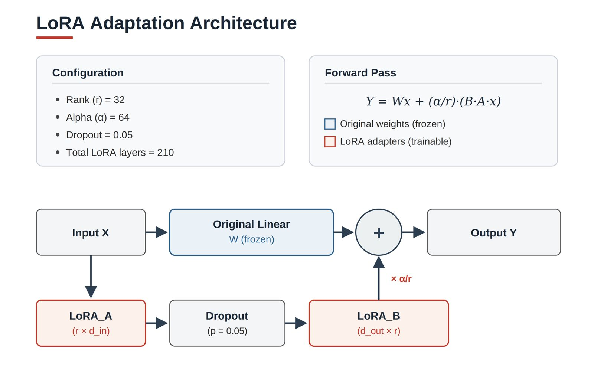
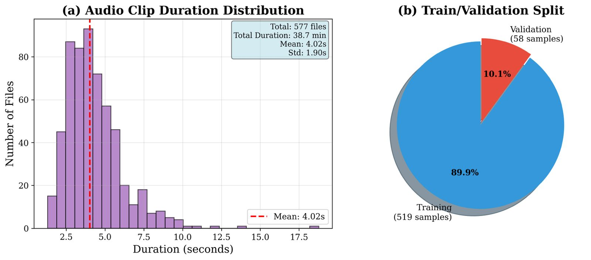
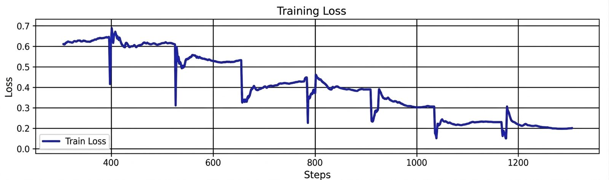
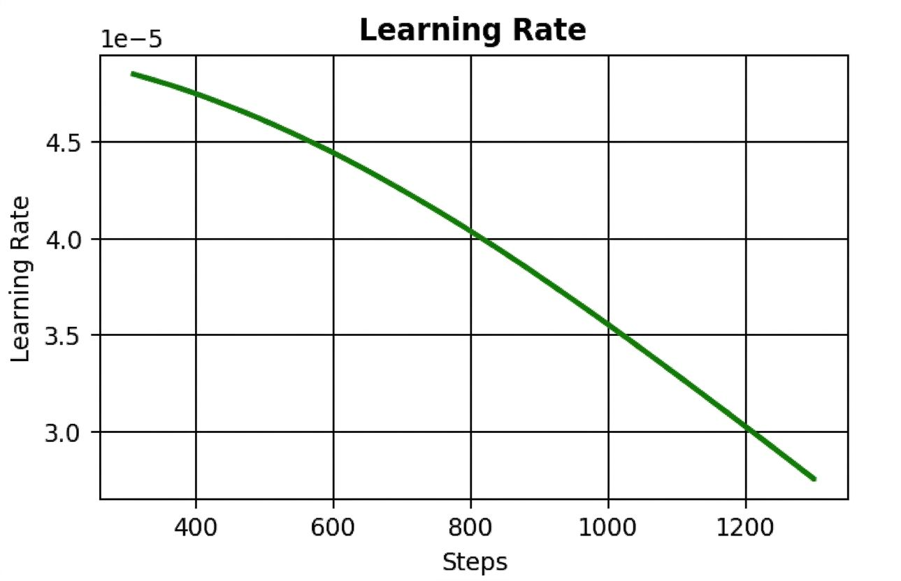
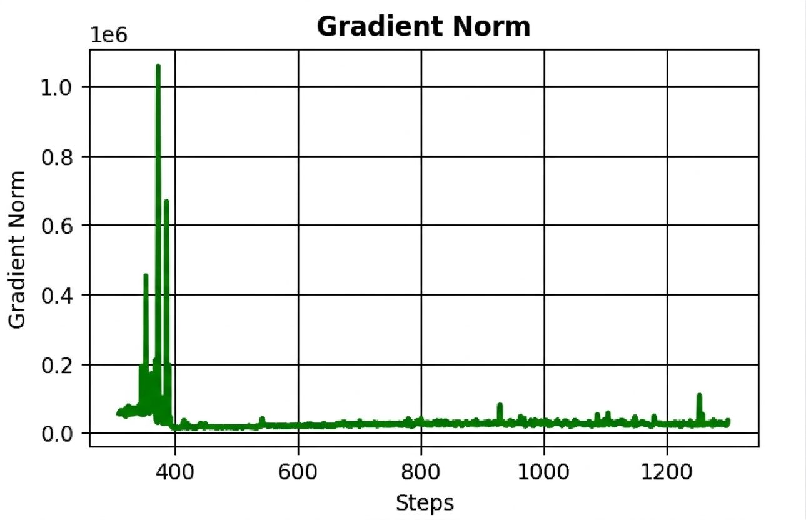
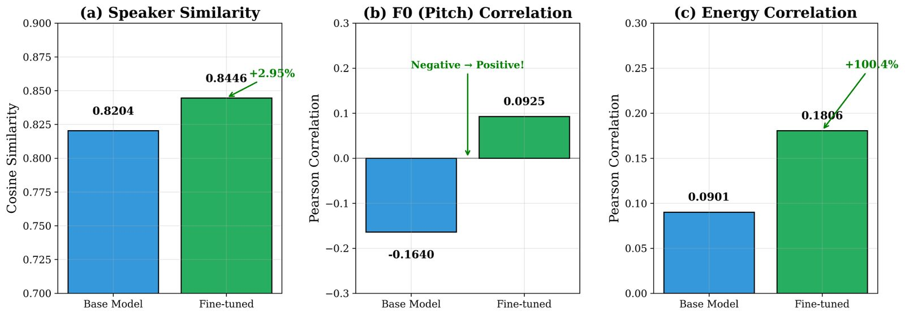
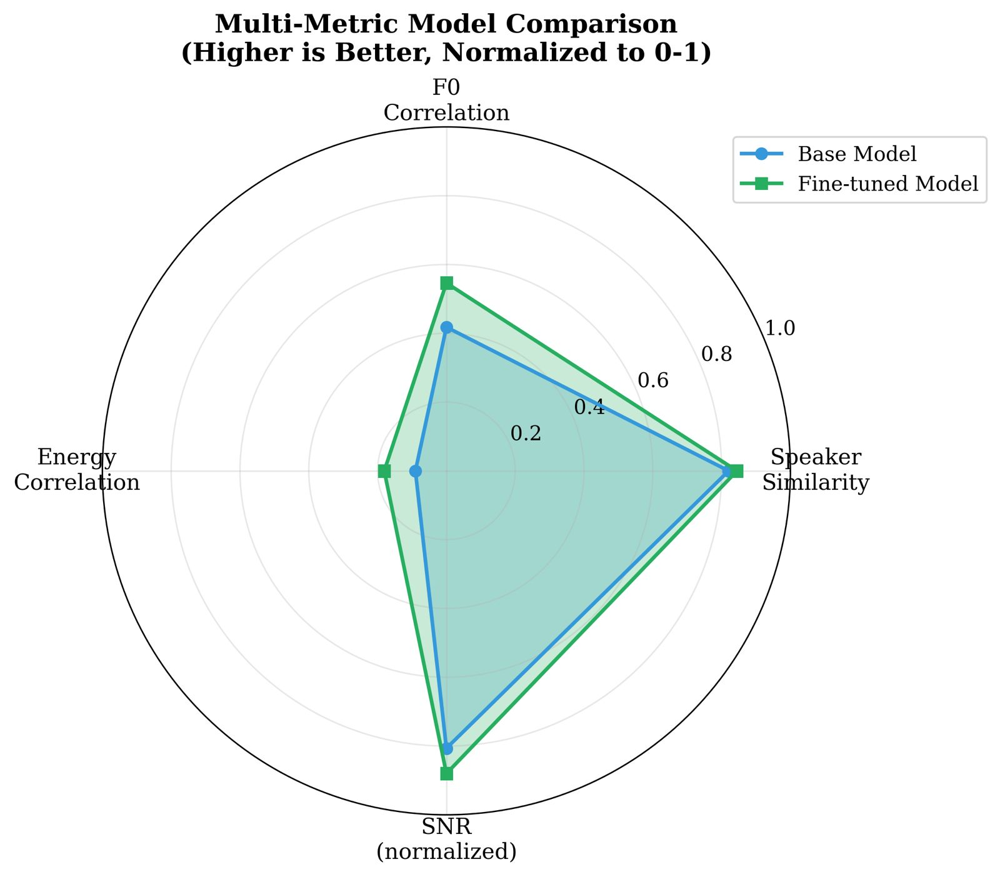

<p align="center">
  
</p>

<h1 align="center">SpeechEcho</h1>
<p align="center"><b>Real-Time Voice Cloning &amp; Conversational Speech Synthesis</b></p>

<p align="center">
  
  
  
  
  
</p>

---

**SpeechEcho** is a full-stack web application for **voice cloning, text-to-speech synthesis, document voiceover, and AI-powered conversational speech**. It is built on the open-source **Chatterbox TTS** model and enhanced with a custom **LoRA (Low-Rank Adaptation) fine-tuning** stage that measurably improves speaker similarity, prosody, and audio quality on a target voice.

> 📄 **For the research paper.** The complete training code, fine-tuned LoRA adapters, and evaluation for this project are hosted in this repository. Include the following link in your paper's **abstract**:
>
> **https://github.com/Mustafa-bacha/SpeechEcho**

## Table of Contents

1. [Overview](#overview)
2. [Key Features](#key-features)
3. [System Architecture](#system-architecture)
4. [Fine-Tuned Model: Chatterbox + LoRA](#fine-tuned-model-chatterbox--lora)
5. [Dataset](#dataset)
6. [Training](#training)
7. [Results &amp; Evaluation](#results--evaluation)
8. [Pretrained &amp; Fine-Tuned Models](#pretrained--fine-tuned-models)
9. [Project Structure](#project-structure)
10. [Getting Started](#getting-started)
11. [Usage](#usage)
12. [API Reference](#api-reference)
13. [Documentation](#documentation)
14. [Tech Stack](#tech-stack)
15. [Acknowledgements](#acknowledgements)
16. [Citation](#citation)
17. [License](#license)

## Overview

SpeechEcho turns a few seconds of reference audio into a personalized synthetic voice that can read documents, hold a spoken conversation, and generate expressive speech in real time. The synthesis engine is **Chatterbox TTS** (a 0.5B-parameter Llama-backbone neural TTS model), which we further specialize to a single target speaker using **parameter-efficient LoRA fine-tuning** — training only ~0.1% of the model's parameters while keeping the base model's zero-shot capabilities intact.

The application is delivered as a React single-page frontend talking to a FastAPI backend that wraps the (LoRA-adapted) Chatterbox model for cloning, streaming TTS, speech-to-text, and conversational chat.

## Key Features

- 🎙️ **Voice Cloning** — clone a voice from a 3–5 second audio sample
- ✨ **Text-to-Speech Studio** — natural speech with adjustable emotion / exaggeration
- 📄 **Document Voiceover** — upload a PDF and convert it to narrated audio
- 🤖 **Conversational AI Chat** — chat interface with spoken voice responses
- 👥 **Multiple Voice Profiles** — predefined or user-cloned voices
- ⚡ **Real-Time Streaming** — low-latency audio generation (~0.47s to first chunk)
- 🎯 **Prosody Control** — exaggeration and classifier-free-guidance weighting

## System Architecture

SpeechEcho is a three-tier system: a **React + Vite** frontend, a **FastAPI** backend that exposes the REST/WebSocket API and business logic, and the **LoRA-adapted Chatterbox TTS** engine that performs cloning, synthesis, and voice conversion.

<p align="center">
  
</p>

```
Frontend (React/Vite)  ──HTTP/WebSocket──►  Backend (FastAPI)  ──►  Chatterbox TTS + LoRA
   pages / studio / chat                     routers / services         S3 tokenizer → T3 (Llama)
   audio playback / streaming                auth · tts · voices        → S3Gen vocoder (24 kHz)
```

## Fine-Tuned Model: Chatterbox + LoRA

### Base model — Chatterbox TTS

| Component | Specification |
|-----------|---------------|
| **Architecture** | 0.5B-parameter Llama backbone (T3) |
| **Text Tokenizer** | EnTokenizer with specialized tokens |
| **Audio Tokenizer** | S3 (semantic speech) tokenizer |
| **Vocoder** | S3Gen neural vocoder (24 kHz output) |
| **Voice Encoder** | Speaker-embedding extraction network |
| **Real-Time Factor** | 0.499 (NVIDIA RTX 4090) |
| **Latency to first chunk** | ~0.472 s |
| **License** | MIT (open source) |

### LoRA adaptation

We inject **Low-Rank Adaptation** adapters into every linear layer of the T3 model, freeze the base weights, and train only the adapters — a small, fast, and memory-efficient way to personalize the voice.

<p align="center">
  
  <br><em>LoRA adapters (rank r) are added in parallel to each frozen linear layer: Y = Wx + (α/r)·(B·A·x).</em>
</p>

| Parameter | Value | Purpose |
|-----------|-------|---------|
| **Rank (r)** | 32 | Low-rank decomposition size |
| **Alpha (α)** | 64 | Scaling factor (2× rank) |
| **Dropout** | 0.05 | Regularization |
| **Target layers** | All linear layers (T3) | Comprehensive adaptation |
| **Total LoRA layers** | 210 | Auto-injected across the model |
| **Trainable parameters** | ~0.1% of base model | Parameter-efficient tuning |

## Dataset

A single-speaker corpus (speaker "Hussain") extracted from natural conversations and recordings.

<p align="center">
  
  <br><em>Left: audio-clip duration distribution. Right: train / validation split.</em>
</p>

| Statistic | Value |
|-----------|-------|
| **Total audio files** | 577 |
| **Total duration** | 38.68 minutes |
| **Average clip length** | 4.02 s (σ ≈ 1.90 s) |
| **Min / Max clip length** | 1.30 s / 25.18 s |
| **Sample rate / channels** | 24 kHz, mono |
| **Format** | WAV |
| **Train / Validation split** | 519 / 58 clips (≈ 90% / 10%) |

## Training

| Setting | Value | Notes |
|---------|-------|-------|
| **Epochs** | 10 | Sufficient for a small dataset |
| **Batch size** | 2 | GPU-memory optimized |
| **Gradient accumulation** | 2 | Effective batch size = 4 |
| **Learning rate** | 5e-5 | Cosine-annealed |
| **Warmup steps** | 130 | ~5% of total steps |
| **Optimizer** | AdamW | — |
| **Scheduler** | Cosine annealing | Smooth LR decay |
| **Hardware** | NVIDIA RTX 4090 (24 GB) | — |
| **Training time** | ~15–20 minutes | End-to-end |
| **Final train / val loss** | 0.1997 / 0.8564 | Converged by epoch 7–8 |

<p align="center">
  
  <br><em>Training loss decreases steadily across steps, with a clean staircase per epoch.</em>
</p>

<p align="center">
  
  
  <br><em>Left: cosine learning-rate schedule. Right: gradient norm (stable after the warmup phase).</em>
</p>

## Results &amp; Evaluation

The fine-tuned model improves across **every** quality metric relative to the base model.

| Metric | Base Model | Fine-Tuned | Improvement |
|--------|-----------|-----------|-------------|
| **Speaker Similarity** (cosine, ECAPA-TDNN) | 0.8204 | **0.8446** | +2.94% ⬆️ |
| **F0 (Pitch) Correlation** | −0.1640 | **+0.0925** | negative → positive ⬆️ |
| **Energy Correlation** | 0.0901 | **0.1806** | +100.4% ⬆️ |
| **Signal-to-Noise Ratio** | 40.33 dB | **44.00 dB** | +9.1% ⬆️ |

<p align="center">
  
  <br><em>Per-metric comparison of the base and fine-tuned models.</em>
</p>

<p align="center">
  
  <br><em>Normalized multi-metric view — the fine-tuned model (green) dominates on all axes.</em>
</p>

**Takeaways:** speaker similarity moves closer to the target voice; pitch (F0) correlation flips from negative to positive, enabling natural prosody; energy dynamics roughly double; and audio is cleaner (higher SNR) — all achieved by training only ~0.1% of the parameters on ~39 minutes of audio.

See [`EVALUATION_REPORT.md`](EVALUATION_REPORT.md) for the full methodology and [`MODEL_DOCUMENTATION.md`](MODEL_DOCUMENTATION.md) for architecture and training details.

## Pretrained &amp; Fine-Tuned Models

Model weights are **not stored in this repository** (they are large binaries and are excluded via `.gitignore`), following standard practice for research code releases.

| Model | Description | Link |
|-------|-------------|------|
| **Chatterbox TTS (base)** | 0.5B Llama-backbone TTS, pre-trained | [ResembleAI/chatterbox](https://huggingface.co/ResembleAI/chatterbox) |
| **SpeechEcho LoRA adapters** | Fine-tuned adapters for the target voice (~39 min data) | _add download link — see note below_ |

> 🔧 **Action needed:** upload the fine-tuned LoRA checkpoint (`checkpoints_lora/`) to Google Drive or the Hugging Face Hub and replace the placeholder link above. After download, place the adapters under `backend/vendor/chatterbox/` (or the path configured in `backend/app/config.py`).

## Project Structure

```
SpeechEcho/
├── backend/                     # FastAPI backend
│   ├── app/
│   │   ├── main.py              # Application entry point
│   │   ├── config.py            # Settings
│   │   ├── database.py          # SQLAlchemy setup
│   │   ├── models/              # DB models (user, chat_history, voice_profile)
│   │   ├── schemas/             # Pydantic schemas
│   │   ├── routers/             # API routes (auth, chat, tts, voices, documents, voice_chat)
│   │   └── services/            # Business logic (tts, stt, voice, chat, chatterbox, storage, document)
│   ├── vendor/chatterbox/       # Vendored Chatterbox TTS (LoRA-adapted) model code
│   ├── static/                  # Generated audio & uploads (gitignored)
│   ├── Dockerfile
│   └── requirements.txt
├── frontend/                    # React + Vite frontend
│   ├── src/
│   │   ├── pages/               # Dashboard, VoiceStudio, VoiceCloning, VoiceChat, Chat, History, Settings, DocumentVoiceover, auth/
│   │   ├── components/          # layout, common, VoiceConversation
│   │   ├── contexts/            # Auth, Chat, Voice, Appearance
│   │   ├── services/            # API layer
│   │   └── App.jsx
│   ├── public/                  # Logos & static assets
│   └── package.json
├── docs/                        # Architecture & workflow diagrams (SVG)
├── images/                      # README figures (architecture, training, evaluation)
├── MODEL_DOCUMENTATION.md       # Full model & LoRA documentation
├── EVALUATION_REPORT.md         # Evaluation methodology & results
├── DOCUMENTATION_SUMMARY.md     # Documentation index
├── QUICKSTART.md                # Fast local setup
├── SETUP.md                     # Full setup guide
├── docker-compose.yml           # Backend + frontend orchestration
└── README.md
```

## Getting Started

### Prerequisites

- **Node.js** ≥ 18.x
- **Python** ≥ 3.10
- **pip** and (recommended) a Python virtual environment
- An NVIDIA GPU is recommended for real-time synthesis (CPU works but is slower)

### Backend

```bash
cd backend
python -m venv venv
source venv/bin/activate            # Windows: venv\Scripts\activate
pip install -r requirements.txt
cp .env.example .env                # then edit .env (see Configuration)
uvicorn app.main:app --reload --port 8000
```

API: `http://localhost:8000` • Interactive docs: `http://localhost:8000/api/docs`

### Frontend

```bash
cd frontend
npm install
npm run dev
```

App: `http://localhost:5173`

### Docker (optional)

```bash
docker-compose up --build
```

For a step-by-step walkthrough see [`QUICKSTART.md`](QUICKSTART.md) and [`SETUP.md`](SETUP.md).

### Configuration

| Variable | Description | Default |
|----------|-------------|---------|
| `SECRET_KEY` | JWT secret key | _required_ |
| `ALGORITHM` | JWT algorithm | HS256 |
| `ACCESS_TOKEN_EXPIRE_MINUTES` | Token expiry | 30 |
| `GEMINI_API_KEY` | Google Gemini key (optional, for AI chat) | _optional_ |
| `DATABASE_URL` | Database URL | `sqlite:///./speechecho.db` |

## Usage

Once both servers are running:

1. **Register / log in** at `http://localhost:5173`.
2. **Clone a voice** — upload a 3–5 second clean audio sample in *Voice Cloning*.
3. **Synthesize** — enter text in the *Voice Studio*, choose a voice, tune exaggeration, and generate/stream audio.
4. **Voiceover a document** — upload a PDF in *Document Voiceover* to produce narrated audio.
5. **Chat** — hold a spoken conversation in *Voice Chat*; responses are synthesized in your chosen voice.

## API Reference

| Area | Endpoint |
|------|----------|
| **Auth** | `POST /api/auth/register` · `POST /api/auth/login` · `GET /api/auth/me` |
| **Voices** | `POST /api/voices/clone` · `GET /api/voices/` · `DELETE /api/voices/{id}` |
| **TTS** | `POST /api/tts/generate` · `POST /api/tts/preview` |
| **Documents** | `POST /api/documents/upload` · `POST /api/documents/convert` |
| **Chat** | `POST /api/chat/message` · `GET /api/chat/history/{session_id}` · `WS /api/chat/ws/{session_id}` |

Full, always-up-to-date schemas are available at `/api/docs` when the backend is running.

## Documentation

| Document | Contents |
|----------|----------|
| [`MODEL_DOCUMENTATION.md`](MODEL_DOCUMENTATION.md) | Chatterbox architecture, LoRA method, training & inference guide |
| [`EVALUATION_REPORT.md`](EVALUATION_REPORT.md) | Evaluation framework, metrics, and detailed results |
| [`DOCUMENTATION_SUMMARY.md`](DOCUMENTATION_SUMMARY.md) | Index and overview of all documentation |
| [`QUICKSTART.md`](QUICKSTART.md) | Fast local setup |
| [`SETUP.md`](SETUP.md) | Full environment setup |

## Tech Stack

**Frontend:** React 18, Vite, Tailwind CSS, React Router, Axios, Lucide React, Framer Motion
**Backend:** FastAPI, SQLAlchemy, Pydantic, python-jose (JWT), pydub, PyPDF2, Google Generative AI (optional)
**Model:** Chatterbox TTS (0.5B Llama backbone) + LoRA adapters, S3 tokenizer, S3Gen vocoder, ECAPA-TDNN (SpeechBrain) for evaluation

## Acknowledgements

- **[Chatterbox TTS](https://github.com/davidbrowne17/chatterbox-streaming)** — the open-source TTS model at the core of SpeechEcho.
- **LoRA** — Hu et al., *"LoRA: Low-Rank Adaptation of Large Language Models"* (2021).
- **[SpeechBrain](https://github.com/speechbrain/speechbrain)** — ECAPA-TDNN speaker embeddings used for evaluation.

## Citation

If you use this work, please cite:

```bibtex
@misc{speechecho2026,
  title        = {SpeechEcho: Real-Time Voice Cloning and Conversational Speech Synthesis},
  author       = {Muhammad Mustafa Shah and Hussain Ahmad and Saud Khan and Rabia Hassan and Farah Saeed},
  year         = {2026},
  howpublished = {\url{https://github.com/Mustafa-bacha/SpeechEcho}},
  note         = {Final Year Project}
}
```

**Authors:** Muhammad Mustafa Shah, Hussain Ahmad, Saud Khan  
**Supervisors:** Ms. Rabia Hassan, Dr. Farah Saeed

## License

This project is developed as a Final Year Project (FYP). **Chatterbox TTS** is licensed under the MIT License; see the upstream repository for details.

---

<p align="center"><b>SpeechEcho</b> — Real-Time Voice Cloning &amp; Conversational Speech Synthesis</p>
